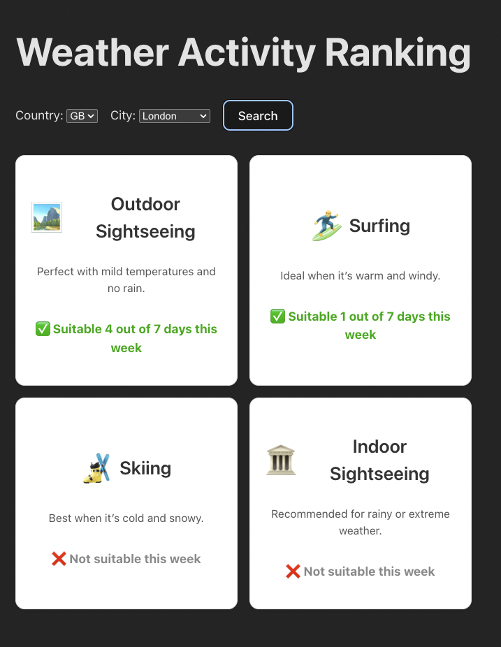

# 🌤️ Weather Activity Ranking – Frontend



This is the frontend for the **Weather Activity Ranking App**, built with React and TypeScript. It allows users to select a country and city, and view weather-based activity recommendations for the next 7 days based on Open-Meteo forecast data.

---

## 🔧 Tech Stack

| Tool / Library        | Purpose                                                   |
|------------------------|-----------------------------------------------------------|
| **React + TypeScript** | Component-based UI with static type safety                |
| **Vite**              | Fast dev server and bundler                               |
| **Axios**             | Simple HTTP client for API requests                       |
| **Vanilla CSS**       | Basic styling without extra complexity (initial version)  |
| **(Optional Tailwind)**| Planned upgrade path for utility-first styling            |

---

## 🧱 Project Structure

```plaintext
src/
├── components/          # Reusable UI components
│   ├── CityForm.tsx     # Country & city selector form
│   └── ActivityCard.tsx # Display activity score info
├── types/               # Type definitions
│   └── Activity.ts      # ActivityScore interface
├── App.tsx              # Root UI logic
├── main.tsx             # Vite entrypoint
└── index.css            # Global styles
```

---

## ✨ Features

### ✅ Country + City Selector
- **Dynamic Form**: Users can select a country (e.g., `GB`, `US`, `NG`) and then pick a city within that country.
- **Linked Dropdowns**: The city dropdown updates dynamically based on the selected country.

### ✅ Activity Ranking Cards
- Displays weather-based scores for 4 activity types:
  - 🏞️ **Outdoor Sightseeing**
  - 🏛️ **Indoor Sightseeing**
  - 🏄 **Surfing**
  - 🎿 **Skiing**
- Each card shows a score (0–7 days) based on the weather forecast.

### ✅ Clean JSON Integration
- The frontend integrates seamlessly with the backend, which returns standardized JSON responses:
```json
{
  "status": "success",
  "data": [
    { "activity": "surfing", "score": 3 },
    { "activity": "skiing", "score": 1 }
  ],
  "error": null
}
```

---

## 🚀 How It Works

1. **Country and City Selection**:
   - Users select a country and city using a dynamic form.
   - The selected values are sent to the backend to fetch weather-based activity scores.

2. **Activity Scoring**:
   - The backend calculates scores for each activity based on the weather forecast.
   - The frontend displays these scores in visually appealing cards.

3. **Responsive Design**:
   - The app is designed to work seamlessly across devices, with a simple and clean UI.

---

## 🛠️ Installation and Setup

1. Clone the repository:
   ```bash
   git clone it@github.com:godswillaniakor/weather-app.git
   cd weather-app/frontend
   ```

2. Install dependencies:
   ```bash
   npm install
   ```

3. Start the development server:
   ```bash
   npm run dev
   ```

4. Open the app in your browser:
   - Navigate to `http://localhost:5173` (default Vite port).

---

## 📜 License

This project is licensed under the MIT License. See the `LICENSE` file for details.